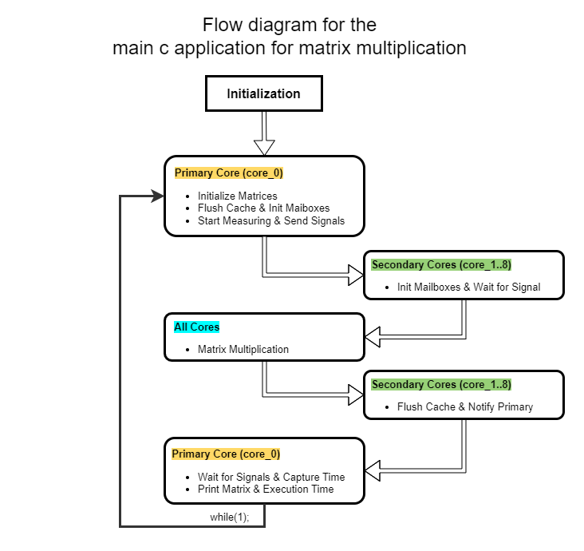

# Performance Analysis of Multi-Core SoPC on Terasic FPGA DE2-115 Development Board
#### A Project Focused on Leveraging Multi-Core Architecture on FPGA for Efficient Matrix Multiplicatoin

This project is centered on the synchronization of multiple Nios II processors on the Terasic FPGA DE2-115 board. The primary objective is to ensure coordination among these processors, a crucial aspect for efficient multi-core systems. To validate the synchronization and assess the system's efficacy, a matrix multiplication application is employed which is a fundamental computational task as benchmark test.


## Introduction
The Nios II processor by Intel is a type of processor that works well on FPGAs. It's flexible and can be customized, making it a popular choice for special-purpose systems. By using multiple Nios II processors together, you can do parallel processing effectively, like speeding up matrix multiplication. Therefore, the goal of this project is to build a system that uses multiple Nios II processors to do matrix multiplication on a Terasic DE2-115 board. 

This project, draws inspiration from a previous work by Igor Semenov, who implemented a multi-core System-on-Programmable Chip (SoPC) architecture on FPGA for matrix multiplication. Semenov's project, available on GitHub, served as a foundational reference for this work. However, this project extends and diverges from the original work in several key aspects. Firstly, while Semenov's design utilized 8 cores, this project leverages a 9-core architecture. Secondly, whereas Semenov's implementation was carried out entirely in SystemVerilog, this project has been implemented using VHDL. These modifications are aimed at exploring the potential performance improvements and learning the intricacies involved in orchestrating multi-core SoPC on FPGA using a different hardware description language. The acknowledgment of Semenov's work is a testament to the collaborative and cumulative nature of engineering research, where new inquiries build upon previous endeavors to push the boundaries of what is possible.

## System Structure
The system is composed of 9 cores which interact via mailboxes and shared memory. A simplified depiction of the core-configuration of the system is displayed in the image below. While it only illustrates two cores, it should provide sufficient insight into the organization of the 9-core system.


Every core possesses its own data memory (RAM) and program memory (ROM). Ideally, program memory could be shared to apply the [SPMD](https://en.wikipedia.org/wiki/SPMD) (Single Program Multiple Data) technique, yet this would have introduced additional complexities within the Platform Designer environment. Therefore, in this instance, separate ROMs are utilized and distinct executables for each core.

The system categorizes cores into two types: primary and secondary. Internally, there's no difference between them, but their connections to each other vary. Each core is equipped with a pair of mailboxes: hardware modules functioning as single-element blocking queues. The receiver can remain on standby at a mailbox until the sender deposits a message.

The primary core does not engage its mailboxes. Their presence is solely because all cores are duplicates of the same subsystem. The primary core can access the mailboxes of the secondary cores: it employs their input mailboxes to signal the availability of data in shared memory, and their output mailboxes to await a signal once they complete their tasks.

Below Block diagram describes the complete multi-core system consisting of 9 instanciated cores and their connectivity with other components. 


## Matrix Multiplication
The matrix multiplication program, found in [main.c](Software/source/main.c), demonstrates parallel data processing in this system, with different executables compiled for each core using a script. The main core (`CORE_ID = 0`) allocates and initializes operand matrices `matA`, `matB`, and result matrix `matC` in shared memory, then flushes the cache for data consistency, as Nios II lacks cache coherency protocols. It measures execution time, notifies secondary cores via mailboxes to start their part of the job, and waits for their completion before printing results and entering an infinite loop. Secondary cores wait for a signal from the main core, execute their part of the multiplication, flush their cache, and signal task completion to the main core before entering an infinite loop.

The image displayed below provides a flow chart representation of the main.c application for executing matrix multiplication operations. This visual diagram meticulously outlines the sequential steps and logical decision points inherent in the application, thereby offering a comprehensive insight into the procedural flow and the underlying algorithmic structure that facilitates the matrix multiplication process. 



## Viewing the System
### Platform Designer 
Platform Designer, bundled with Intel Quartus, is a GUI tool for easily integrating hardware components like Nios II processors, block RAM, and various controllers through drag-and-drop. Components are interconnected via interfaces like Avalon and AXI3. 

Open Quartus Prime, navigate to Tools -> Platform Designer, then open the [nios_multicore.qsys](Hardware/qsys_files/nios_multicore.qsys) file from this repository to view or edit the system.

### Subsystems 
Platform Designer facilitates the creation of subsystems for easier resource replication. You can group components together into a module (subsystem), and replicate it as needed. Any later modifications to the module are made in one spot, automatically updating all instances. While useful for multi-core systems, this mechanism is basic as it lacks subsystem parametrization.

In my multi-core Nios II setup, I bundled the processor, RAM, ROM, and two mailboxes into a subsystem, termed a core, replicated it eight times, and interconnected these higher-level components. Due to the absence of parametrization, all cores are identical, leading to suboptimal resource usage. For instance, the main core has unnecessary mailboxes, and all cores have uniform RAM and ROM size, though secondary cores require less memory as they don't utilize the printf function.

To view a core's interior, right-click on any of the 9 cores and select 'Drill into subsystem'.


To go back to the larger view, right click over any module and choose Move up.

The images displayed below illustrate the connectivity of components within the entire system. They also highlight the instantiation of nine cores, showcasing the structured arrangement and interlinkages among the system's integral parts. 


## Running the system
### HDL Synthesis
To evaluate the system, the initial step is to synthesize the hardware. Launch the `Hardware/MultiCore_Design.qpf` project within Quartus Prime. Disregard any IP upgrade warning that may appear. Navigate to Processing -> Start Compilation to initiate the synthesis process. It may require some time for the process to complete due to the substantial size of the system. Upon successful completion of the synthesis, the result should resemble the following:


### Loading Hardware Configuration to FPGA
Connect the DE2-115 to your PC using a USB cable. In Quartus Prime, navigate to Tools -> Programmer. Click on Start to transfer the `MultiCore_Design.sof` file onto the board.


### Manual BSP Files Generation
Board Support Packages (BSP) house the code essential for interfacing with hardware modules, potentially encompassing physical addresses of these modules, thereby eliminating the need for hardcoded addresses in user code and manual updates following modifications in Platform Designer. Within the Quartus Prime environment, generating BSPs is a streamlined process based on the hardware design, achievable with a few button clicks. However, each processor within a system necessitates a distinct BSP. Consequently, in a multi-core system, manual generation of BSPs could become a cumbersome task.


### Opening Nios II Command Shell
To automate the generation of BSPs and project compilation for any number of processors, a script is developed, alleviating the manual effort. This script also sets up the BSPs to recognize the shared memory region. For a deeper understanding of how BSPs are configured, you can refer to the content of .

The script is executed within the Nios II Command Shell environment, a feature bundled with Quartus Prime, and can be located using the search panel in Windows 10 or Windows 11.

Upon launching the shell, navigate to your local copy of this repository to run [script.sh](Software/script/script.sh) by entering:

```cd "C:<path-to-repo>\nios_multicore"```

### Generating BSPs and projects
Create the BSP for the desired number of cores. In the existing version, you have the flexibility to select any number of cores ranging from 1 to 9. Below is an example illustrating the use of 9 cores:

```./script.sh generate_bsp_files 9```

Regardless of the number you opt for, the hardware system encompasses 9 cores; hence, the number you specify merely determines how many cores will be engaged in executing the program.

### Compiling projects
To autonomously compile a distinct executable for each core, execute the command below:

```./script.sh compile_projects 9```

Ensure that the number of cores (indicated by the second parameter) aligns with the count of cores utilized in the preceding step.

### Running executables on Nios II cores
To load the executable files onto the Nios cores automatically, ensure the DE2-115 board is connected to your PC via USB-Blaster, then execute the command:

```./script.sh load_elf_files 9```

The core count should correspond with the number specified in earlier steps. This script initiates by loading executables onto secondary cores, followed by the main core. Subsequently, you should observe the output displayed by the main core within the same window.


The script outputs the result of multiplying an identity matrix by another matrix with single-digit hexadecimal elements. Additionally, it displays the execution time, aiding in gauging the parallelization efficiency.

To halt the script, press Ctrl+C, reverting to the command window.

## Performance Analysis
The following table contains execution time for the same matrix (99x99 elements) multiplication program, but running on a different number of cores

| \# of cores | Execution time (cc) | Speedup | Efficiency |
| ----------- | ------------------- | ------- | ---------- |
| 1           | 88655392            | 1.000   | 100.0%     |
| 2           | 44175814            | 2.010   | 100.5%     |
| 3           | 29945605            | 2.960   | 98.7%      |
| 4           | 21940468            | 4.040   | 101.0%     |
| 5           | 17512538            | 5.060   | 101.2%     |
| 6           | 14887069            | 5.950   | 99.2%      |
| 7           | 13164454            | 6.730   | 96.1%      |
| 8           | 11422273            | 7.760   | 97.0%      |
| 9           | 10606127            | 8.360   | 92.9%      |


Through the analysis and visualization of the provided data, it’s evident that increasing the number of cores in a system tends to reduce the clock cycle count and execution time, showcasing the impact of parallel processing. From the graph in below, it is obvious that the peak efficiency is on utilizing 4 and 5 cores. Efficiency tends to decrease as more cores are added, signaling suboptimal utilization of additional processing units. This behavior adheres to Amdahl’s Law, affirming that the performance improvements from parallelization are subject to limitations, especially for tasks with non-parallelizable components. 


## Contributing

Feel free to fork the project, create a new branch for your work, and open a pull request.


